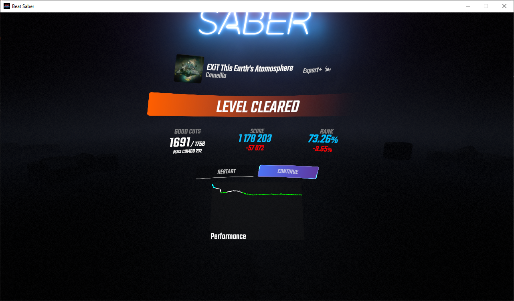

# PerformanceMeter
A Beat Saber mod to show a graph of your energy bar, percentage level, or cut value throughout a map on the end screen.

## Requirements
* Beat Saber 1.20.0 or compatible
* BSIPA 4.2.2
* Beat Saber Utils 1.12.1
* BeatSaberMarkupLanguage 1.6.3

## Installation
Simply drop the latest PerformanceMeter.dll plugin file into your Plugins folder, inside the main Beat Saber installation directory.

## Usage
Out of the box, PerformanceMeter displays a graph of the energy bar's status from the beginning of the level to the end, whether that's the end of the level or whenever you failed. This is shown on the level complete screen underneath the buttons. The lines are colored depending on the value of the endpoint and the color scheme of the selected mode.

You can change the type of data PerformanceMeter records in the Mod Settings. See below for more information on how to do this.

Note: PerformanceMeter only appears in Solo, Party, and Campaign game modes. It does not appear in online matches.

## Configuration
### UI
PerformanceMeter can be configured in the Mod Settings section of the options. Here you can enable/disable PerformanceMeter, change the mode and side for primary and secondary graphs, and toggle showing missed notes.

As of PerformanceMeter 1.2.0, two graphs can be displayed at the same time. These graphs will be displayed together on the Performance chart. To be able to discern the two graphs, it is recommended that you set the sides of each graph to different values to show them in different colors. Note that changing the sides of Cut Value modes will also change which hand is counted.

These are the modes available as of 1.3.0:

#### Energy
This mode records the level of the energy bar on every note hit or miss.

| Max % | Min % | Color  |
|-------|-------|--------|
| 100%  | 50%   | Green  |
| 49%   | 25%   | Yellow |
| 24%   | 0%    | Red    |

#### Percentage (Modified)
This mode records the percentage with all modifiers applied on every note hit or miss.

| Max % | Min % | Color  |
|-------|-------|--------|
| 100%+ | 90%   | Cyan   |
| 89%   | 80%   | White  |
| 79%   | 65%   | Green  |
| 64%   | 50%   | Yellow |
| 49%   | 35%   | Orange |
| 34%   | 0%    | Red    |

#### Percentage (Raw)
This mode records the percentage with no modifiers applied on every note hit or miss.

| Max % | Min % | Color  |
|-------|-------|--------|
| 100%  | 90%   | Cyan   |
| 89%   | 80%   | White  |
| 79%   | 65%   | Green  |
| 64%   | 50%   | Yellow |
| 49%   | 35%   | Orange |
| 34%   | 0%    | Red    |

#### Note Cut Value
This mode records the score given for each note cut.
| Max Score | Min Score | Color    |
|-----------|-----------|----------|
| 115       | 115       | White    |
| 114       | 101       | Green    |
| 100       | 90        | Yellow   |
| 89        | 80        | Orange   |
| 79        | 60        | Red      |
| 59        | 0         | Dark Red |

#### Average Cut Value
This mode records the average score of all cuts up to the current one on every note hit.

| Max Score | Min Score | Color    |
|-----------|-----------|----------|
| 115       | 115       | White    |
| 114       | 101       | Green    |
| 100       | 90        | Yellow   |
| 89        | 80        | Orange   |
| 79        | 60        | Red      |
| 59        | 0         | Dark Red |

More modes may be added in the future.

### JSON
PerformanceMeter's configuration file is stored at `UserData\PerformanceMeter.json`. Here you can change some options regarding how PerformanceMeter looks and acts.

#### `enabled`
This toggles PerformanceMeter on and off. When set to `false`, recording is disabled and the graph will not be shown.

#### `mode`
This changes what data PerformanceMeter records in-game. These are the mappings between ID and mode statistic:

| ID | Statistic             |
|----|-----------------------|
| 0  | Energy                |
| 1  | Percentage (Modified) |
| 2  | Percentage (Raw)      |
| 3  | Note Cut Value        |
| 4  | Average Cut Value     |
| 5  | None                  |

#### `side`
This changes the side which PerformanceMeter records data for. This only changes collection for Cut Value-type modes, but it changes the colors for all modes.

| ID | Side  | Color     |
|----|-------|-----------|
| 0  | Left  | Red       |
| 1  | Right | Blue      |
| 2  | Both  | No change |

#### `secondaryMode`, `secondarySide`
These function the same as `mode` and `side`, respectively, but display another line to be used with a different mode.

#### `showMisses`
This enables displaying vertical bars on the graph at each point a note is missed. When set to `false`, no bars will be displayed; when `true`, bars will be shown.

#### `animationDuration`
This sets how long the graph reveal animation takes to complete. If set to 0, no animation will be played.

#### `[secondary]Color`
These set the color for each graph. Colors are 24-bit hexadecimal colors (e.g. `0xFF8000` is orange). This setting has no effect unless the corresponding `overrideColor` setting (below) is enabled.

#### `override[Secondary]Color`
These toggle whether the override color is enabled for each graph. If set to `true`, the color in `[secondary]Color` will be used; otherwise the default color will be used.

## Special Thanks
Thanks to @SHv2 for rewriting a significant chunk of the code to improve style and performance.

## License
PerformanceMeter is licensed under the MIT license. See LICENSE for more info.