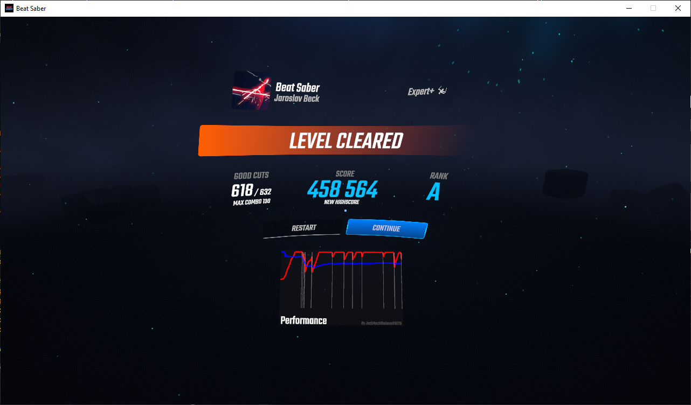

# PerformanceMeter
A Beat Saber mod to show a graph of your energy bar or percentage level throughout a map on the end screen.

## Requirements
* Beat Saber 1.13.0 or compatible
* BSIPA 4.1.3 or later
* Beat Saber Utils 1.6.5 or later

## Installation
Simply drop the latest PerformanceMeter.dll plugin file into your Plugins folder, inside the main Beat Saber installation directory.

## Usage
Out of the box, PerformanceMeter displays a graph of the energy bar's status from the beginning of the level to the end, whether that's the end of the level or whenever you failed. This is shown on the level complete screen underneath the buttons. Energy above 50% is displayed in green, energy between 50% and 25% is displayed in yellow, and energy below 25% is displayed in red.

You can also configure PerformanceMeter to measure percentage instead of energy level. This will display different colors per rank, using the same color set as Counters+. You can tell it either to use the raw percentage, or the percentage after applying modifiers.

## Configuration
### UI
PerformanceMeter can be configured in the Mod Settings section of the options. Here you can enable/disable PerformanceMeter, as well as change the mode.

### JSON
PerformanceMeter's configuration file is stored at `UserData\PerformanceMeter.json`. Here you can change some options regarding how PerformanceMeter looks and acts.

#### `enabled`
This toggles PerformanceMeter on and off. When set to `false`, recording is disabled and the graph will not be shown.

#### `mode`
This changes what data PerformanceMeter records in-game. As of 1.0.0, these modes are available:

| ID | Statistic             |
|----|-----------------------|
| 0  | Energy bar            |
| 1  | Percentage (modified) |
| 2  | Percentage (raw)      |
| 3  | Note Cut Value        |
| 4  | Average Cut Value     |

More modes may be added in the future.

## License
PerformanceMeter is licensed under the MIT license.